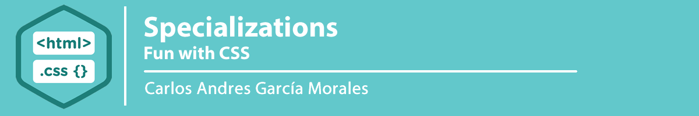

## :orange_book: Fun with CSS

In this project, you will experiment and implement fun layout with HTML and CSS ONLY!

Yes, no JavaScript!

Enjoy!

## :books: Tasks

**0. Sprite languages**

- [0-styles.css](0-styles.css/)

[Watch Online](https://codepen.io/agzsoftsi/full/PoNjgjp)

By using this HTML:

```sh
<!DOCTYPE html>
<html lang="en">
    <head>
        <meta charset="UTF-8" />
        <title>HBTN - 0- Sprite</title>

        <link href="0-styles.css" media="all" rel="stylesheet" type="text/css">
    </head>
    <body>
        <ul>
            <li>HTML<span class="icon i-html"></span></li>
            <li>CSS<span class="icon i-css"></span></li>
            <li>JavaScript<span class="icon i-js"></span></li>
        </ul>
    </body>
</html>

```

Create 0-styles.css and generate this layout:

And this image file: [0-sprite.png](images/sprite.png)

You are not allowed to change the image and the HTML - sprite is cool!


**1. Move the (under)line**

Files: [1-styles.css](1-styles.css/)

[Watch Online](https://codepen.io/agzsoftsi/full/rNewbog)

By using this HTML:

```sh
<!DOCTYPE html>
<html lang="en">
    <head>
        <meta charset="UTF-8" />
        <title>HBTN - 1- Underline</title>

        <link href="1-styles.css" media="all" rel="stylesheet" type="text/css">
    </head>
    <body>
        <h2>
            Hello <a href="https://www.holbertonschool.com">Holberton!</a>
        </h2>
    </body>
</html>
```

Create 1-styles.css and generate this layout where the underline is hidden by 
default and appeared slowly…:


**2. Toggle**

Files: [2-styles.css](2-styles.css/)

[Watch Online](https://codepen.io/agzsoftsi/full/vYGZoLO)

By using this HTML:

```sh
<!DOCTYPE html>
<html lang="en">
    <head>
        <meta charset="UTF-8" />
        <title>HBTN - 2- toggle</title>

        <link href="2-styles.css" media="all" rel="stylesheet" type="text/css">
    </head>
    <body>
        <div class="toggle">
            <input type="checkbox" name="toggle" class="toggle-cb" id="toggle-0" checked>
            <label class="toggle-label" for="toggle-0">
                <div class="toggle-inner"></div>
                <div class="toggle-switch"></div>
            </label>
        </div>
    </body>
</html>
```

Create 2-styles.css and generate this layout where the <input> is has this custom toggle layout:

Checked:


Unchecked:


You are not allowed to change the HTML


**3. Menu**


By using this HTML:

```sh
<!DOCTYPE html>
<html lang="en">
    <head>
        <meta charset="UTF-8" />
        <title>HBTN - 2- toggle</title>

        <link rel="stylesheet" href="https://maxcdn.bootstrapcdn.com/font-awesome/4.7.0/css/font-awesome.min.css">
        <link href="3-styles.css" media="all" rel="stylesheet" type="text/css">
    </head>
    <body>

        <nav class="menu">
            <input type="checkbox" href="#" class="menu-open" name="menu-open" id="menu-open"/>
            <label class="menu-open-button" for="menu-open">
                <span class="menu-line menu-line-1"></span>
                <span class="menu-line menu-line-2"></span>
                <span class="menu-line menu-line-3"></span>
            </label>

            <a href="#" class="menu-item"> <i class="fa fa-area-chart"></i> </a>
            <a href="#" class="menu-item"> <i class="fa fa-bar-chart"></i> </a>
            <a href="#" class="menu-item"> <i class="fa fa-line-chart"></i> </a>
            <a href="#" class="menu-item"> <i class="fa fa-pie-chart"></i> </a>
            <a href="#" class="menu-item"> <i class="fa fa-table"></i> </a>
        </nav>

    </body>
</html>
```

Create 3-styles.css and generate this layout/animation:


You are not allowed to change the HTML


## :sagittarius: Author

> :man: Carlos Andres Garcia Morales

> :e-mail: [E-mail](agzsoftsi@gmail.com)

> :octocat: [Github](https://github.com/agzsoftsi)

> :bird: [Twiiter](https://twitter.com/karlgarmor)

> :blue_book: [Linkedin](https://twitter.com/karlgarmor)

> :globe_with_meridians: [WebPage](https://www.agzsoftsi.tech/)
